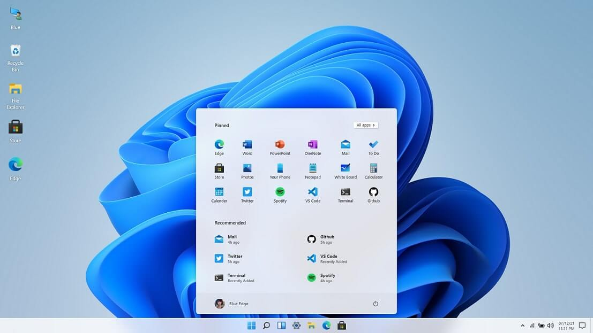
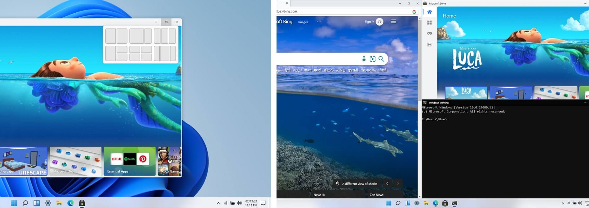

# Win11 in React!

[](https://github.com/solomonshalom)
[](https://twitter.com/shalomlijo)
[](https://discord.gg/6ADbrPKPdR)
[](https://github.com/solomonshalom/windows-portfolio/actions/workflows/deploy.yml)

[](https://translate.andrewstech.me/)

[](https://ko-fi.com/R5R54FIIG))](https://ko-fi.com/solomonlijo)

Hello! Welcome to my newly updated portfolio built with React, CSS, Tailwind and Good'Ol Javascript. 

## Notice
>#### This project is **not in anyway affiliated with Microsoft** and **should not be confused with Microsoft’s Operating System** or Products.
>#### This is also not Windows 365 cloud PC.

work in progress 

------------
 #### Live Experience🌈: [windows-porfolio.vercel.app](windows-porfolio.vercel.app)



# Gallery





# Why

WHY NOT? Why not just waste a week of your life creating a React project, just to cover up your insecurities of how incompetent you are. Just why not!

# Features
- [x] Start Menu, Search Menu and Widgets
- [x] Desktop and Right Click action
- [x] Side Navigation and Calendar View
- [x] Snap windows in different layouts
- [x] Browser, Store, Terminal, Calculator
- [x] Notepad, Vscode, Whiteboard
- [x] File Explorer + Setting
- [x] Drag and Resize windows
- [x] Startup and Lock screen
- [x] Themes and Background
- [x] Multilang Support

📑 [suggest more](https://github.com/solomonshalom/windows-portfolio/issues/new/choose)

# Stack

- Framework - React (^17.0.2) + Redux
- Component/UI Library - None!!
- Styling Solution - SCSS and CSS Modules (tailwind).
- Icons - fontawesome

## FAQ

- Is this the full operating system?
  - No, This is not a full operating system and It is also not affiliated by Microsoft in anyway.

- How long did it take? 
  - Honestly It took 2-3 days collecting assets, 2-3 planning and about 6 days programming it.


- Did you use any UI/Library?
  - No.


- Can I contribute?
  - Yes, you can! Open an issue, create a pull request, head over to [discussions](https://github.com/solomonshalom/windows-portfolio/discussions) or join the [discord](https://discord.gg/6ADbrPKPdR).


- Where did you get the inspiration from, if you have?
  - I got the inspiration from [this youtube video](https://www.youtube.com/watch?v=OtOmxa9UMe8).


- What is the answer of Life, the Universe, and Everything?
  - Jesus Christ
## Local Deployment

# Docker

To use docker use the following command ``` docker run -d  --restart unless-stopped --name windows-portfolio -p 3000:3000 blueedge/windows-portfolio:latest ```

# Homeassistant

[](https://my.home-assistant.io/redirect/supervisor_add_addon_repository/?repository_url=https%3A%2F%2Fgithub.com%2Funofficial-skills%2Faddons)

# Balena-Cloud

[](https://dashboard.balena-cloud.com/deploy?repoUrl=https://github.com/solomonshalom/windows-portfolio)

--------------------------------------------------------------------------------------------------------

# Compiled

You can find a compiled `.exe` in the **Releases** section or via clicking [HERE](https://github.com/solomonshalom/windows-portfolio/releases)

**WINGET - WINDOWS PACKAGE MANAGER**

If you have one of the latest windows builds then you can enter the command below in **CMD**

``` winget install blueedge.windows-portfolio ```


## Online Deployment

[](https://heroku.com/deploy)

[](https://railway.app/new/template?template=https%3A%2F%2Fgithub.com%2FSolomon Shalom Lijo%2Fwindows-portfolio&envs=PORT&PORTDesc=Port+of+the+application&PORTDefault=3000&referralCode=BatemaDevelopment)

[](https://app.netlify.com/start/deploy?repository=https://github.com/solomonshalom/windows-portfolio)

[](https://vercel.com/new/clone?repository-url=https%3A%2F%2Fgithub.com%2FSolomon Shalom Lijo%2Fwindows11%2F&project-name=windows11&repo-name=windows11-react&demo-title=Windows%2011%20Demo&demo-description=Static&demo-url=https%3A%2F%2Fwin11.blueedge.me%2F)

### Known Issues

- Blur not working in Firefox browser.

###### Solution:

1. Open `about:config` in your firefox browser.
2. Search for `layout.css.backdrop-filter.enabled` and set it to `true`.

## License

⚖️ CC0-1.0 License          
